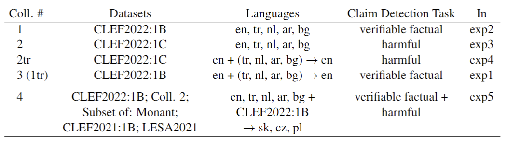

# Multilingual Models for Checkworthy Social Media Posts Detection

This repository contains the code for the paper *"Multilingual Models for Checkworthy Social Media Posts Detection"*.

## Abstract

This work presents an extensive study of transformer-based NLP models, dedicated to detection of social media posts containing verifiable factual claims and harmful claims. The document summarizes activities carried out during the pipeline execution, which led to the design of the NLP models for post detection. These activities included dataset collection, dataset pre-processing, architecture selection, setting up the experiments, model training (fine-tuning), model testing and implementation. Comprehensive analysis of various models was conducted. Special attention was focused on multilingual models, which are capable of processing English social media posts and simultaneously posts of low-resource languages, like: Polish, Czech, Slovak and Bulgarian. The obtained results were validated with state-of-the-art models and the comparison proved the robustness of the created models. The work's novelty consists in multi-label, multilingual classification models, which can efficiently perform simultaneous detection of harmful posts and of social media posts containing verifiable factual claims.

## Organization of the Repository

The repository is organized as follows:
* files_split.ipynb - notebook for splitting the data into train, dev and test sets;
* Training_testing.ipynb - notebook for training and testing based on the Flair package;
* files_translated.ipynb - notebooks that show how the translated parts of the collections were assembled together and preprocessed;

## Data

This work uses data from the following sources:
* **CLEF2021:** Shaden Shaar, Maram Hasanain, Bayan Hamdan, Zien Sheikh Ali, Fatima Haouari, Alex Nikolov, Mücahid Kutlu, Yavuz Selim Kartal, Firoj Alam, Giovanni Da San Martino, Alberto Barrón-Cedeño, Rubén Míguez, Javier Beltrán, Tamer Elsayed, and Preslav Nakov. 2021. Overview of the CLEF-2021 checkthat! lab task 1 on check-worthiness estimation in tweets and political debates. In Proceedings of the Working Notes of CLEF 2021 - Conference and Labs of the Evaluation Forum, Bucharest, Romania, September 21st - to - 24th, 2021, volume 2936 of CEUR Workshop Proceedings, pages 369–392. CEUR-WS.org.

* **CLEF2022:** Preslav Nakov, Alberto Barrón-Cedeño, Giovanni Da San Martino, Firoj Alam, Rubén Míguez, Tommaso Caselli, Mücahid Kutlu, Wajdi Zaghouani, Chengkai Li, Shaden Shaar, Hamdy Mubarak, Alex Nikolov, and Yavuz Selim Kartal. 2022. Overview of the CLEF-2022 checkthat! lab task 1 on identifying relevant claims in tweets. In Proceedings of the Working Notes of CLEF 2022 - Conference and Labs of the Evaluation Forum, Bologna, Italy, September 5th - to - 8th, 2022, volume 3180 of CEUR Workshop Proceedings, pages 368–392. CEUR-WS.org.

* **LESA2021:** Shreya Gupta, Parantak Singh, Megha Sundriyal, Md. Shad Akhtar, and Tanmoy Chakraborty. 2021. LESA: Linguistic encapsulation and semantic amalgamation based generalised claim detection from online content. In Proceedings of the 16th Conference of the European Chapter of the Association for Computational Linguistics: Main Volume, pages 3178–3188, Online. Association for Computational Linguistics.

* **Monant:** Ivan Srba, Robert Moro, Jakub Simko, Jakub Sevcech, Daniela Chuda, Pavol Navrat, and Maria Bielikova. 2019. Monant: Universal and extensible platform for monitoring, detection and mitigation of antisocial behavior. In Proceedings of Workshop on Reducing Online Misinformation Exposure (ROME 2019), pages 1–7.

    Ivan Srba, Branislav Pecher, Tomlein Matus, Robert Moro, Elena Stefancova, Jakub Simko, and Maria Bielikova. 2022. Monant medical misinformation dataset: Mapping articles to fact-checked claims. In Proceedings of the 45th International ACM SIGIR Conference on Research and Development in Information Retrieval (SIGIR ’22), New York, NY, USA. Association for Computing Machinery;

The data was used to set up the following 5 collections used in 5 different experiments in the paper:

As indicated in the table, in some of the collections, non-English (Turkish, Dutch, Arabic, Bulgarian) posts were machine-translated to English.